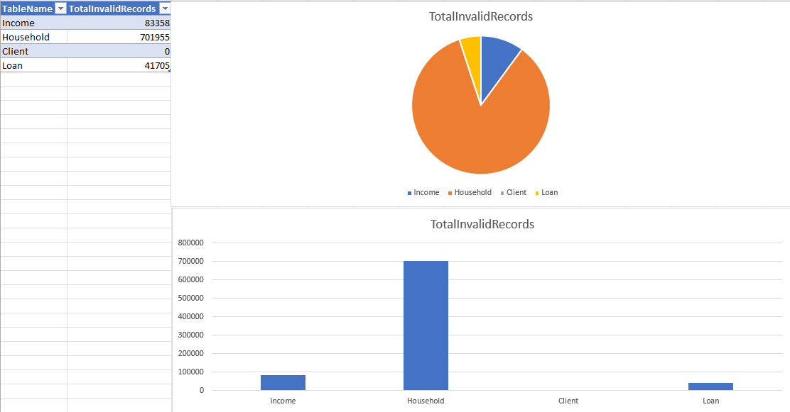
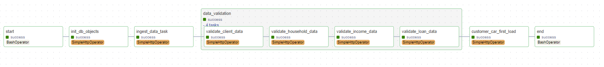
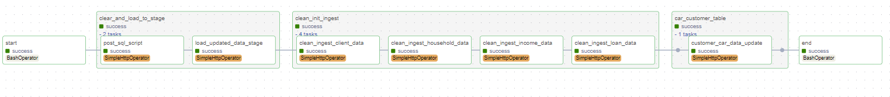

# Piggybank migration project

## 1. Introduction

This project represents a migration of Piggybank's current insfrastucture to a new one,due to the fact that the
current infrastructure is not scalable and is not able to handle the amount of data that
is being processed, a new infrastructure is needed.

## 2. Architecture

The current architecture is presented in the following diagram:


## 3. Infrastructure

The new infrastructure consists of the following components:

- SQLite database
- Apache Airflow
- Docker
- Flask

## 4. Overview of database objects

### 4.1 Data normalization

For the client, household, and income tables,
the date format was standardized to 'YYYY-MM-DD' for ensuring consistency
across database.

### 4.2 Client table

```sqlite
CUSTOMER_ID    integer not null
REPORTING_DATE date    not null
AGE            integer not null
EDUCATION      varchar not null
BUCKET         integer not null
```

Primary Key: 

Composite key of CUSTOMER_ID and REPORTING_DATE to uniquely identify a client's record at each reporting
interval.

Indexes:

On AGE, EDUCATION, and CUSTOMER_ID to improve query performance on these frequently accessed attributes.

### 4.3 Household table

Columns: 
```sqlite
HOUSEHOLD_ID   integer not null
INCOME_ID      integer not null
REPORTING_DATE date    not null
MARRIED        char    not null
HOUSE_OWNER    char    not null
CHILD_NO       integer not null
HH_MEMBERS     integer not null
BUCKET         integer not null
```

**Primary Key**: 

Composite key of HOUSEHOLD_ID and REPORTING_DATE for unique identification of household records over time.

**Foreign Key**:

INCOME_ID references the income table, connecting household data to corresponding income records.

**Indexes**:

On INCOME_ID and HOUSEHOLD_ID to facilitate quick access and effective join operations.

### 4.4 Income table

Columns: 

```sqlite
INCOME_ID      integer not null
CUSTOMER_ID    integer not null
REPORTING_DATE date    not null
FIRST_JOB      char    not null
INCOME         integer not null
BUCKET         integer not null
```


**Primary Key**:

Composite key of INCOME_ID and REPORTING_DATE to ensure uniqueness across different income reports.

**Foreign Key**:

CUSTOMER_ID references the client table to link income information to the respective client.

**Indexes**: 

On CUSTOMER_ID and INCOME_ID for efficient data retrieval and join operations.

### 4.5 Loan table

Columns:
```sqlite
LOAN_ID         integer not null
CUSTOMER_ID     integer not null
REPORTING_DATE  date    not null
INTODEFAULT     char    not null
INSTALLMENT_NM  integer not null
LOAN_AMT        decimal not null
INSTALLMENT_AMT decimal not null
PAST_DUE_AMT    decimal not null
BUCKET          integer not null
```


**Primary Key**: 

Composite key of LOAN_ID and REPORTING_DATE to differentiate between multiple records of the same loan over time.

**Foreign Key**:

CUSTOMER_ID references the client table to associate the loan with the correct client.

**Indexes**:

On CUSTOMER_ID and LOAN_ID to optimize loan information searches and relationship mapping.

### 4.6 Customer_car table

Columns:
```sqlite
CUSTOMER_ID              INTEGER NOT NULL
CLIENT_REPORTING_DATE    DATE
CLIENT_AGE               INTEGER
CLIENT_EDUCATION         VARCHAR
CLIENT_BUCKET            INTEGER
HOUSEHOLD_ID             INTEGER
HOUSEHOLD_INCOME_ID      INTEGER
HOUSEHOLD_REPORTING_DATE DATE
HOUSEHOLD_MARRIED        CHAR
HOUSEHOLD_HOUSE_OWNER    CHAR
HOUSEHOLD_CHILD_NO       INTEGER
HOUSEHOLD_HH_MEMBERS     INTEGER
HOUSEHOLD_BUCKET         INTEGER
LOAN_ID                  INTEGER
LOAN_REPORTING_DATE      DATE
LOAN_INTODEFAULT         CHAR
LOAN_INSTALLMENT_NM      INTEGER
LOAN_AMT                 DECIMAL
LOAN_INSTALLMENT_AMT     DECIMAL
LOAN_PAST_DUE_AMT        DECIMAL
LOAN_BUCKET              INTEGER
INCOME_ID                INTEGER
INCOME_REPORTING_DATE    DATE
INCOME_FIRST_JOB         CHAR
INCOME_AMOUNT            INTEGER
INCOME_BUCKET            INTEGER
```           

**Primary Key**:

CUSTOMER_ID as a unique identifier for each record.

**Foreign Keys**:

References to CUSTOMER_ID, HOUSEHOLD_ID, LOAN_ID, and INCOME_ID establish connections to respective tables.

**Indexes**:

On CUSTOMER_ID, HOUSEHOLD_ID, LOAN_ID, INCOME_ID and also the same IDs with their REPORTING_DATE columns to enhance the performance of temporal and relational queries.

## 5. Data quality metrics

The data that didn't pass the quality checks is stored in a separate tables for each table:
- client_bad_records
- household_bad_records
- income_bad_records
- loan_bad_records

In data ingestion process, if a record doesn't pass the quality checks, it will get a _FALSE_ value int IS_VALID column and  
concatenation of column names (separated by '~') that didn't pass the quality checks in INVALID_COLUMNS column. Also to column 
_CREATION_DTM_ is added the exact time when the record was ingested for later analysis.

### 5.1 No. of invalid records per data pipeline execution

To check how many record didn't pass the quality checks in today's data pipeline execution, run the following query:

```sqlite
SELECT
    'Income' AS TableName,
    COUNT(*) AS TotalInvalidRecords
FROM income_bad_data where DATE(CREATION_DTM) = current_date

UNION ALL

SELECT
    'Household',
    COUNT(*)
FROM household_bad_data where DATE(CREATION_DTM) = current_date

UNION ALL

SELECT
    'Client',
    COUNT(*)
FROM client_bad_data where DATE(CREATION_DTM) = current_date

UNION ALL

SELECT
    'Loan',
    COUNT(*)
FROM loan_bad_data where DATE(CREATION_DTM) = current_date;
```

We can use it in visualization like this:



###  5.2 Number of invalid data per column per table

To check how many records for each column didn't pass the quality checks per column per table
, we can use a views created for this purpose called _recent_data_quality_issues_ and _all_time_data_quality_issues_.

They use statement
```sql
UNION ALL
``` 
to add four different results from four different tables. We can use this in visualization tool like Power BI where then we can get specific columns for four types of dashboards.


## 6. ERD Diagrams

### ERD diagram of main tables


### Other non-connected tables


## 7. Data pipeline process

The whole data pipeline process is presented in the following diagram:


Airflow DAG has tasks which then call Flask API endpoints to execute _.sql_ scripts on SQLite CLI through Powershell scripts.


### 7.1 First load

First load is executed only once and it is used to:
- Create tables, indexes and views
- Load data from CSV files to stage tables
- Validate data
- Load validated data to target tables
- Load data to customer_car table

Used SQL scripts for this pipeline are:
- init_db_objects.sql
- client_data_cleaning_init.sql
- household_data_cleaning_init.sql
- income_data_cleaning_init.sql
- loan_data_cleaning_init.sql
- customer_car_ingest_init.sql

Here we can see the whole process:


This process is loading data as it would be the first time. As input data it uses CSV files from data/raw folder. <br>The data is loaded to stage tables, then validated and loaded to target tables.

### 7.2 Adding new values

This DAG is for data that is new and needs to be added to the database. It is executed every day at 12:00 AM.

It uses the following SQL scripts:
- clear_stage_tables.sql
- client_data_cleaning_new_rows.sql
- household_data_cleaning_new_rows.sql
- income_data_cleaning_new_rows.sql
- loan_data_cleaning_new_rows.sql
- customer_car_update.sql

Here we can see the whole process:


This process is loading data from CSV files in data/new_client_data folder.

## 8. Recommendations for RDBMS

SQLite is a good option as for very small buisnesses, but for Piggybank it is not a good option. It is not scalable and it is not able to handle the amount of data that is being processed. <br>
For Piggybank, I would recommend PostgreSQL due to it's scalability and ability to handle large amounts of data. It is also open source and has a large community of users. <br>

For example all of the customer data could be partitioned by date in PostgreSQL. This would allow for faster queries on the most recent or historical data for analysis.
Another example of PostreSQL being a better choice here is it's big set of functions and operators for working with unstructured data, like CSV files.

If in the future we would decide that we still want to use SQLite, we would have to take in account that it will not be able to manage very large datasets. <br>
The data write speed is also very slow in SQLite, so it would be a problem with concurrency because of it's data locking mechanism. <br>

Of course it would be a much bigger investment to use PostgreSQL, but it would be worth it in the long run especially if Piggybank wants to grow.